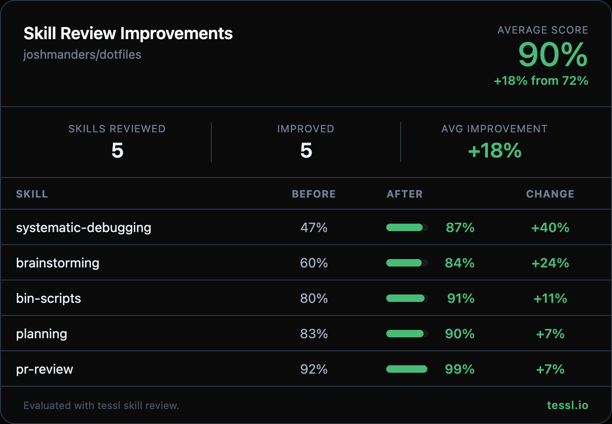

Hey @joshmanders 👋

I ran your skills through `tessl skill review` at work and found some targeted improvements. Here's the full before/after:

| Skill | Before | After | Change |
|-------|--------|-------|--------|
| systematic-debugging | 47% | 87% | +40% |
| brainstorming | 60% | 84% | +24% |
| bin-scripts | 80% | 91% | +11% |
| planning | 83% | 90% | +7% |
| pr-review | 92% | 99% | +7% |

## Summary

- Improved skill descriptions with concrete actions, explicit trigger terms, and "Use when..." clauses so Claude selects them more reliably
- Trimmed verbose content (rationalizations tables, motivational filler, redundant sections) to stay within token budget without losing the actual debugging/planning methodology
- Added concrete inline examples (question sequences, design section output) to brainstorming skill

Detailed changes

### systematic-debugging (+40%)
- Rewrote description to list concrete actions (diagnoses, reads errors, reproduces, traces data flow, isolates root causes) and added missing trigger terms (error, crash, exception)
- Removed "Common Rationalizations" table, "Red Flags" list, "Human Partner's Signals" section, and "Real-World Impact" stats — these consumed significant tokens coaching Claude on things it already knows
- Kept the full four-phase workflow, multi-component diagnostic example, and supporting technique references intact

### brainstorming (+24%)
- Rewrote description with specific actions (gathers requirements, proposes 2-3 approaches, presents designs incrementally) and narrowed trigger scope from "any creative work" to specific scenarios
- Added concrete example question sequence and example design section output
- Removed redundant "Key Principles" section that restated the process, kept only the two non-obvious principles (YAGNI, incremental validation)

### bin-scripts (+11%)
- Expanded description to list specific capabilities (git commits, branch management, artisan commands, killing processes by port, Caddy dev sites)
- Added safety warning to destructive `git-abort` command

### planning (+7%)
- Added concrete actions to description (creates issues with acceptance criteria, links issues to PRs, breaks features into scoped tasks)
- Removed redundant "Session Context Tracking" section and duplicate PR summary format example
- Preserved the full workflow, scope creep handling, and all gh CLI commands

### pr-review (+7%)
- Added explicit "Use when..." clause with natural trigger terms (review a pull request, look at a PR, give feedback on code changes)
- No content changes — body was already scoring 100%

Honest disclosure — I work at @tesslio where we build tooling around skills like these. Not a pitch - just saw room for improvement and wanted to contribute.

Want to self-improve your skills? Just point your agent (Claude Code, Codex, etc.) at [this Tessl guide](https://docs.tessl.io/evaluate/optimize-a-skill-using-best-practices) and ask it to optimize your skill. Ping me - [@yogesh-tessl](https://github.com/yogesh-tessl) - if you hit any snags.

Thanks in advance 🙏
